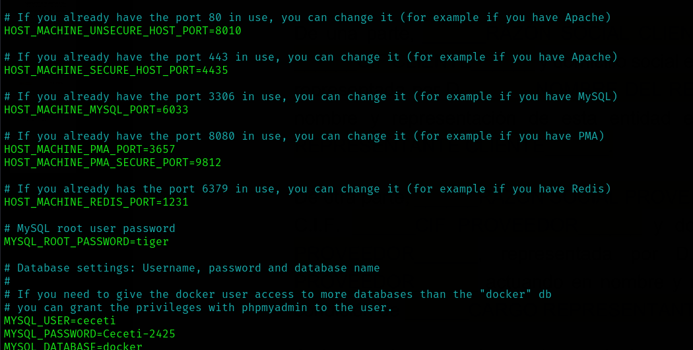
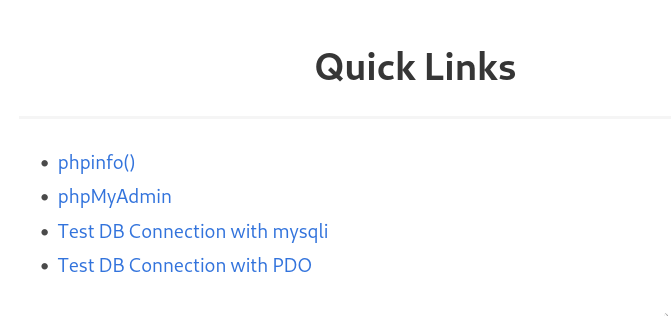
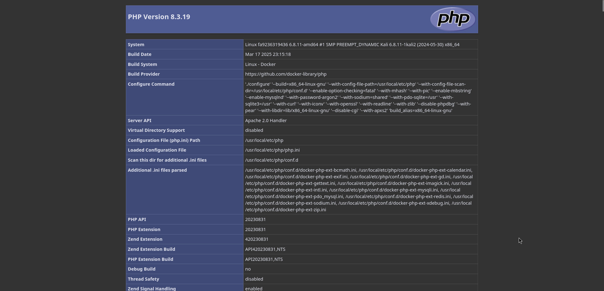
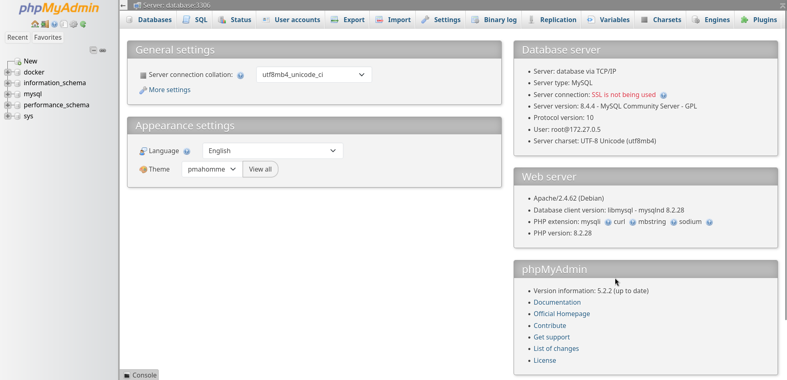
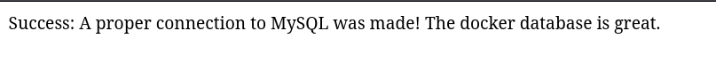
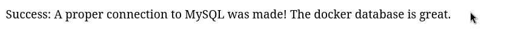
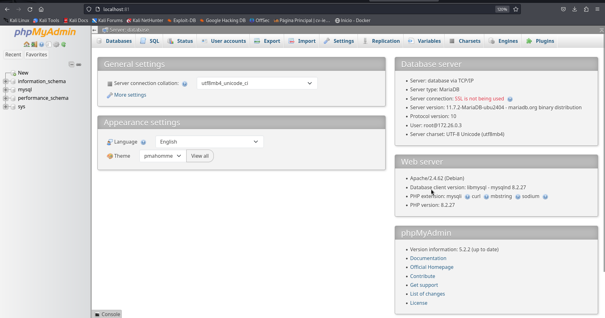
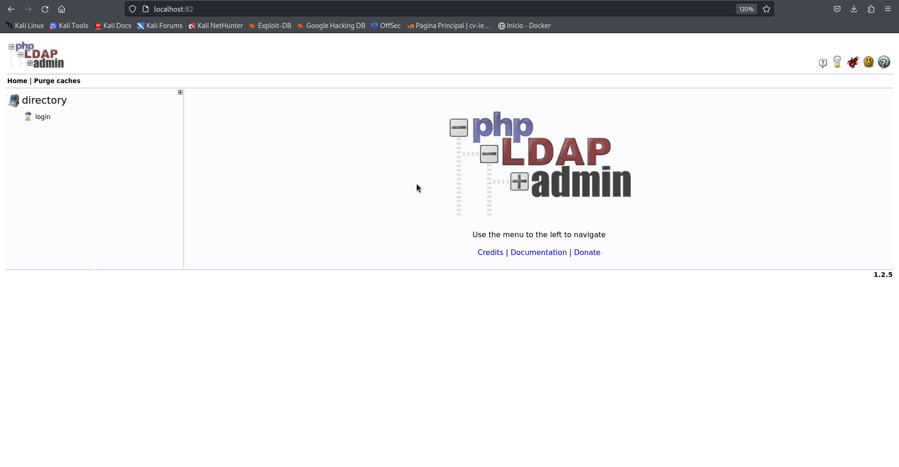
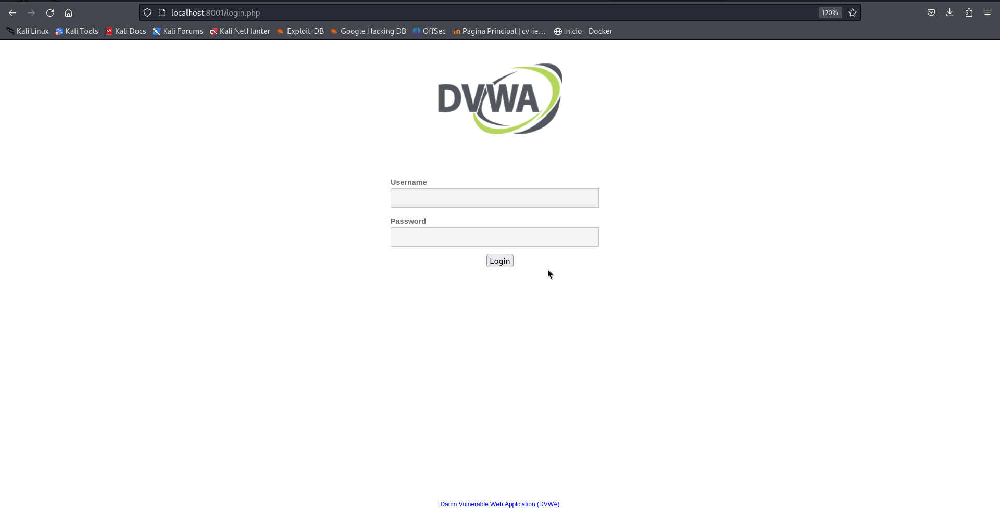
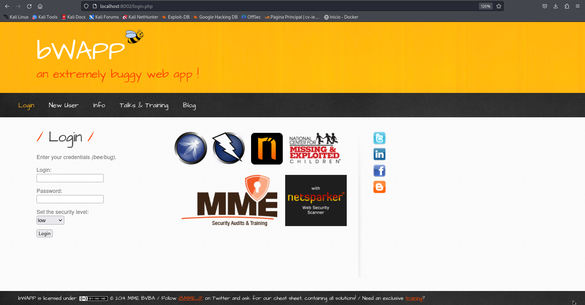

# PPS-Unidad3Actividad1-Aaron


## Entorno de pruebas
Vamos también a crear un entorno de pruebas en los que vamos a realizar las prácticas, creando servidores y archivos con vulnerabiliades presentes, para corregirlas posteriormente.

Tenemos diferentes opciones para realizarlo, entre ellas:

- Crear una máquina virtual e instalar todo lo necesario: Una pila sea del tipo que sea: LAMP, LEMP, MEAN, XAMPP, WAMP y AMPPS.

- Crear un escenario multicontenedor con cualquiera de esas pilas.

En esta ocasión vamos utilizar la segunda opción, crearemos un escenario multicontenedor con cualquiera de las pilas que nos podemos encontrar en docker hub. Yo he utilizado la primera que me he encontrado:https://github.com/sprintcube/docker-compose-lamp.git

Veamos:

- Clonamos el repositorio en nuestro equipo local.
```bash
git clone https://github.com/sprintcube/docker-compose-lamp.git
```
- Entramos dentro de la carpeta del proyecto.
```bash
cd docker-compose-lamp/
```
-  Hacemos una copia del fichero sample.env en un fichero llamado .env. Démonos cuenta que este fichero es el que contiene las variables que se van a utilizar en las diferentes máquinas que vamos a crear. si lo abrimos, tiene este aspecto:
```bash
cp sample.env .env
```

Antes de continuar, para securizar las variables por defecto que vienen en sample.env vamos a modificarlas.
En mi caso, he cambiado las variables de los puertos y las varibales de credeciales por defecto.



Al finalizar la configuración de las variables, podemos levantar el entorno con el siguiente comando:
```bash
docker-compose up -d
```

Y su todo nos va bien, tendremos el entorno correctamente levando al que podemos acceder desde el puerto que hayamos especificado en las variables.


Dentro del entorno podemos acceder a todos los servicios que hemos levantado desde el apartado de links rápidos.



Si accedemos a cada uno de los apartados debería mostrar algo como lo siguiente:







## Entorno de máquinas vulnerables

He levantado el entorno de las máquinas vulnerables a partir del siguiente docker-compose.yml:

```bash
# Documentation: https://github.com/compose-spec/compose-spec/blob/master/spec.md
# Purpose: Build local containers for the Mutillidae environment
---
version: '2.4'

services:

  dvwa_web:
    image: cytopia/dvwa:php-${PHP_VERSION:-8.1}
#    restart: unless-stopped
    ports:
      - "${LISTEN_PORT:-8002}:80"
    networks:
      - labpps-net
    environment:
      - RECAPTCHA_PRIV_KEY=${RECAPTCHA_PRIV_KEY:-}
      - RECAPTCHA_PUB_KEY=${RECAPTCHA_PUB_KEY:-}
      - SECURITY_LEVEL=${SECURITY_LEVEL:-low}
      - PHPIDS_ENABLED=${PHPIDS_ENABLED:-0}
      - PHPIDS_VERBOSE=${PHPIDS_VERBOSE:-0}
      - PHP_DISPLAY_ERRORS=${PHP_DISPLAY_ERRORS:-1}
      - MYSQL_HOSTNAME=dvwa_db
      - MYSQL_DATABASE=dvwa
      - MYSQL_USERNAME=dvwa
      - MYSQL_PASSWORD=p@ssw0rd

  dvwa_db:
    image: mariadb:10.1
    hostname: dvwa_db
    volumes:
      - dvwa_db_data:/var/lib/mysql
    environment:
      MYSQL_ROOT_PASSWORD: rootpass
      MYSQL_DATABASE: dvwa
      MYSQL_USER: dvwa
      MYSQL_PASSWORD: p@ssw0rd
#    restart: unless-stopped
    networks:
      - labpps-net

  bwapp:
    image: feltsecure/owasp-bwapp
#    restart: unless-stopped
    ports:
      - "${LISTEN_PORT:-8001}:80"
    networks:
      - labpps-net

  kali:
    image: jmmedinac03/kali_pps
    hostname: kali
    cap_add:
      - NET_ADMIN
    stdin_open: true
    tty: true
    volumes:
      - /home/jmmedinac03/docker/PPS/LABPPS/kali-volume:/root/kali
#    restart: unless-stopped
    networks:
      - labpps-net

# Máquinas de multidillae
  database:
    container_name: database
    image: docker.io/webpwnized/mutillidae:database
    networks:
      - datanet

  database_admin:
    container_name: database_admin
    depends_on:
      - database
    image: docker.io/webpwnized/mutillidae:database_admin
    ports:
      - 127.0.0.1:81:80
    networks:
      - datanet

  # Port 8080 is for StackHawk to scan. Use port 8088 for Burp-Suite
  # IP 127.0.0.1 is for mutillidae.localhost or www.mutillidae.localhost
  # IP 127.0.0.1 is for cors.mutilliiidae.localhost
  www:
    container_name: www
    depends_on:
      - database
      - directory
    image: docker.io/webpwnized/mutillidae:www
    ports:
      - 127.0.0.1:80:80
      - 127.0.0.1:8080:80
      - 127.0.0.1:443:443
      - 127.0.0.2:80:80
      - 127.0.0.2:8080:80
      - 127.0.0.2:443:443
    networks:
      - datanet
      - labpps-net

  directory:
    container_name: directory
    image: docker.io/webpwnized/mutillidae:ldap
    volumes:
      - ldap_data:/var/lib/ldap
      - ldap_config:/etc/ldap/slapd.d
    ports:
      - 127.0.0.1:389:389
    networks:
      - labpps-net

  directory_admin:
    container_name: directory_admin
    depends_on:
      - directory
    image: docker.io/webpwnized/mutillidae:ldap_admin
    ports:
      - 127.0.0.1:82:80
    networks:
      - labpps-net

# Create network segments for the containers to use
networks:
  labpps-net:
    driver: bridge
  datanet:

# Volumes to persist data used by the LDAP server
volumes:
  dvwa_db_data:
  ldap_data:
  ldap_config:

```

Con este docker compose se nos levanta todo lo necesario para tener en funcionamiento las siguientes máquinas vulnerables:




